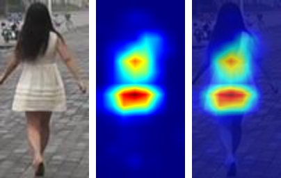
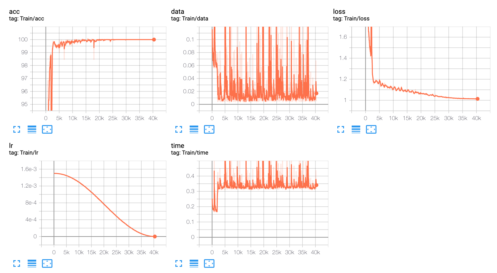

# OS-Net implementation
This repository is utilized and heavily depend on [deep-person-reid](https://github.com/KaiyangZhou/deep-person-reid).

## Project organization
### Folders:
- `configs`: Some configuration files (`.yaml` format) used to run different OS-Net versions

- `scripts`: 
    + `main.py` main file to create instances to train and inference model.
    + `default_config.py` default configuration of all hyper-parameters for the training and testing process

- `tools`: some helper functions to visualize the effetiveness of the models. We use `visualize_actmap.py` to visualize the CNN focus loaction to extract features.

- `torchreid`: all of the projects necessary components, which contain:
    + **data**: data manager classes, used as dataset loader.
    + **loss**: implementation of auxiliary loss functions (cross-entropy and triplet loss).
    + **metrics**: Scores evaluation of model's output (mAP, Rank-1, Rank-5, ...).
    + **models**: Bunch of models to extract image features (especially OS-Net: `osnet.py`).
    + **engine**: engine class used to train and inference model with given specific information.
    + **optim**: implementation of optimizer, learning rate scheduler proposed in the paper.
    + **utils**: other helper functions for all tasks above.

- `notebooks`: all notebooks we used to train and inference models with different configurations

### Files:
- `README.rst`: author's README
- `requirements.txt`, `setup.py`: prerequisite packages for this project

## Install:
1. `cd` to right working directory
```
cd source
```
2. install requirements
```
pip install -r requirements.txt
```
3. install torchreid module
```
python setup.py develop
```

## Train
- For example: train OS-Net on Market1501 benchmark, with cross-entropy loss.
```
python scripts/main.py \
--config-file configs/im_osnet_x1_0_softmax_256x128_amsgrad_cosine.yaml \
--transforms random_flip random_erase \
--root $PATH_TO_DATA
```

- The dataset folder should be organized as
```
PATH_TO_DATA/
    |__ market1501/
```

## Inference
- For example: inference OS-Net on Market1501 benchmark, with trained weight saved in `WEIGHT_DIR`. Turn flag `test.visrank` on to visualize top-10 ranking result
```
python scripts/main.py \
--config-file configs/im_osnet_x1_0_softmax_256x128_amsgrad_cosine.yaml \
--root $PATH_TO_DATA \
model.load_weights $WEIGHT_DIR \
test.evaluate True
test.visrank True
```

- To visualize activation map
```
!python tools/visualize_actmap.py \
--root "datasets" \
--save-dir $SAVE_DIR \
--weights $WEIGHT_DIR
```

## Result
1. An example of visualizing a single query results:
- Top-10 most similar images from the gallery


- Activation map indicates where the model focuses on to extract features


2. use tensorboard to visualize training logs:
```
tensorboard --logdir $LOG_DIR
```




Training result: 
- **acc** : accuracy for each iteration
- **data** : time to load each batch during training
- **loss** : in this example, we only use classification loss so this is the plot of cross-entropy loss function
- **lr** : learning rate values through time
- **time** : time to forward and backward each iteration

In case of training with triplet loss, we have 2 plots of loss values: `loss_t` (triplet loss) and `loss_x` (classification loss)


## Pretrained result:
- Strategy 1, Loss: classification , 200 epochs, data augmentation: random flip, color jitter. [weight](https://drive.google.com/file/d/1gA8J46Cf53DI4vNkCNeWmq4QuloL-jqN/view?usp=sharing) ,  [log](https://drive.google.com/file/d/1ERo60vQ5Sxo1x4BIHKknTfZdDl5We9bd/view?usp=sharing)

- Strategy 2, Loss: triplet , 200 epochs, data augmentation: random flip, color jitter. [weight](https://drive.google.com/file/d/1cxicD57phOzoPFVqI9w8cd1ifMlebAYV/view?usp=sharing) ,  [log](https://drive.google.com/file/d/1VBcblzfIVfmjCM1hBTnMYCszafUfNdRO/view?usp=sharing)